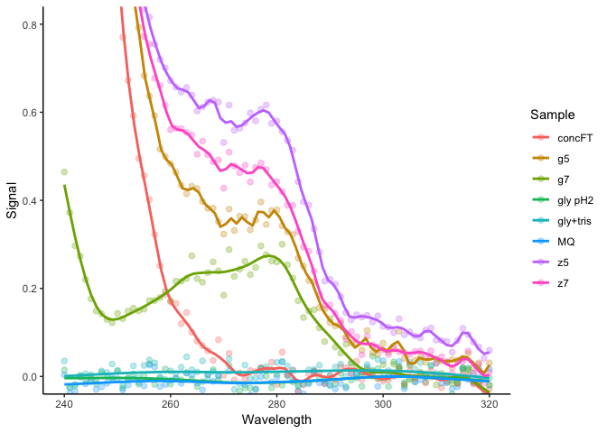

# Что надо сделать

* Измерить спектры 4 белков (Protein A mutants Z5, Z7, G5, G7) против 0.1 M Gly pH 2.5
* Проверить, что они похожи на спектры белков
* Посмотреть на уровень рассеяния
* Посмотреть спектр поглощения воды, буфера 0.1 M Gly pH 2.5 после нейтрализации Трисом и проскока от концентрирования на предмет содержания белка

# Описание измерения

1. Чтобы уменьшить погрешность при измерении спектов и контроль и опыт измеряю в одной и той же кювете
2. Для этого сначала ставлю кювету с контролем в позицию №1 и провожу измерение, экспортирую спектр в XLS (_который на поверку оказался XLSX!_) и подписываю, добавляя в имя файла буквы "ref"
3. Затем каждую пробу измеряю аналогичным образом (см. пункт 2), подписываю так, чтобы это что-то значило
4. Затем используя ниже преведенный скрипт на `R` вычитаю опыт из контроля, строю спектры и фиксирую OD

<details><summary>Загружаем функции... </summary>
<p>


```r
# open spectrum file
library(tidyverse)
library(readxl)
library(splines)
library(knitr)
library(kableExtra)

load_spectra = function(dir){ # dir for xls(x) files
  files = list.files(path = dir, pattern = "*.xls*", ignore.case = T)
  loaded = list()
  for (file in files) {
    label = str_replace(str=file, pat= ".*\\} (.*)\\.[Xx][Ll][Ss][Xx]?", "\\1")
    item_name = ifelse(str_detect(file, fixed("ref", ignore_case = T)), "REF", label)
    loaded[[item_name]] = read_xlsx(paste(dir, file, sep=''), skip = 18)
  }
  return(loaded)
}

smooth.spline2 <- function(formula, data, ...) { 
  mat <- model.frame(formula, data) 
  smooth.spline(mat[, 2], mat[, 1])
} 

predictdf.smooth.spline <- function(model, xseq, se, level) {
  pred <- predict(model, xseq)
  data.frame(x = xseq, y = pred$y)
}

# subtract ref, plot & table the results

analyse_spectra = function(
  loaded_list,
  xlim = c(240, 320),
  ylim = c(0, 0.8),
  smooth.spar = NULL
  ){
  if (!('REF' %in% names(loaded_list))) stop("No reference 'REF' found!")
  sign = ifelse(loaded_list[['REF']]$Absorbance[1]>0, 1, -1)
  result = tibble(Wavelength = loaded_list[['REF']]$Wavelength)
  items = setdiff(names(loaded_list), 'REF')
  for (item in items){
    result[[item]] = (loaded_list[['REF']]$Absorbance - loaded_list[[item]]$Absorbance)*-sign
  }
  res_table = result %>% filter(Wavelength %in% c(260, 280, 320)) %>% t()
  colnames(res_table) = res_table[1,]
  res_list = list()
  res_list$OD_table = res_table[-1,] %>% round(., 3)
  result_l = result %>% gather("Sample", "Signal", -Wavelength)

  res_list$plot = ggplot(result_l, aes(x=Wavelength, y=Signal, col=Sample)) + 
    geom_point(size=2, alpha=.3) + 
    stat_smooth(method='smooth.spline2', se=F) + 
    coord_cartesian(ylim=ylim, xlim=xlim) + 
    theme_classic()
  return(res_list)
}
```
</p>
</details>

... и запускаем процесс анализа.


```r
res = analyse_spectra(load_spectra("/Volumes/Document/Personal/Altshuler_E/misc/2018-11-20/"))
res$plot %>% print()
```

<!-- -->

```r
res$OD_table %>% kable() %>% kable_styling(full_width = F)
```

<table class="table" style="width: auto !important; margin-left: auto; margin-right: auto;">
 <thead>
  <tr>
   <th style="text-align:left;">   </th>
   <th style="text-align:right;"> 260 </th>
   <th style="text-align:right;"> 280 </th>
   <th style="text-align:right;"> 320 </th>
  </tr>
 </thead>
<tbody>
  <tr>
   <td style="text-align:left;"> z5 </td>
   <td style="text-align:right;"> 0.672 </td>
   <td style="text-align:right;"> 0.580 </td>
   <td style="text-align:right;"> 0.059 </td>
  </tr>
  <tr>
   <td style="text-align:left;"> gly pH2 </td>
   <td style="text-align:right;"> -0.017 </td>
   <td style="text-align:right;"> 0.005 </td>
   <td style="text-align:right;"> -0.003 </td>
  </tr>
  <tr>
   <td style="text-align:left;"> MQ </td>
   <td style="text-align:right;"> -0.009 </td>
   <td style="text-align:right;"> -0.002 </td>
   <td style="text-align:right;"> 0.017 </td>
  </tr>
  <tr>
   <td style="text-align:left;"> concFT </td>
   <td style="text-align:right;"> 0.169 </td>
   <td style="text-align:right;"> -0.018 </td>
   <td style="text-align:right;"> -0.029 </td>
  </tr>
  <tr>
   <td style="text-align:left;"> gly+tris </td>
   <td style="text-align:right;"> 0.013 </td>
   <td style="text-align:right;"> 0.032 </td>
   <td style="text-align:right;"> -0.020 </td>
  </tr>
  <tr>
   <td style="text-align:left;"> g7 </td>
   <td style="text-align:right;"> 0.172 </td>
   <td style="text-align:right;"> 0.260 </td>
   <td style="text-align:right;"> -0.019 </td>
  </tr>
  <tr>
   <td style="text-align:left;"> g5 </td>
   <td style="text-align:right;"> 0.483 </td>
   <td style="text-align:right;"> 0.379 </td>
   <td style="text-align:right;"> 0.031 </td>
  </tr>
  <tr>
   <td style="text-align:left;"> z7 </td>
   <td style="text-align:right;"> 0.561 </td>
   <td style="text-align:right;"> 0.442 </td>
   <td style="text-align:right;"> 0.010 </td>
  </tr>
</tbody>
</table>

# Выводы

* Белок есть
* Спектры похожи на белковые, хотя странные
* Проскок от концентрирования странно поглощает на OD < 280, остальные контроли не поглощают
